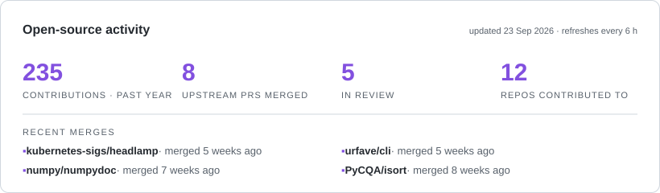

<div align="center">

# Utkarsh Tiwari

### AI product builder turning ambiguous signals into explainable, production-ready systems

[](https://utkarshalpha.github.io)
[](https://www.linkedin.com/in/utkaxh/)
[](mailto:utkarsh7854@gmail.com)
[](https://github.com/utkarshalpha)


</div>

I am a B.Tech Computer Science and Engineering student specializing in Data Science at Bennett University (2023–2027). I work at the intersection of **AI product management, backend engineering, and applied AI**, with an emphasis on evidence, evaluation, and clear product decisions.

- 🔭 Building AI products with deterministic validation around probabilistic models
- 🎯 Interested in AI Product Management, Product Strategy, and Product Operations roles
- 🌱 Contributing to open source across the Python and JavaScript tooling ecosystems
- 📫 Open to product and AI engineering opportunities

## Tech stack

**Languages**


**AI & Backend**


**Frontend**


**Data & Infrastructure**


## Selected work

| Project | What it demonstrates | Evidence |
|---|---|---|
| **[BenNest](https://bennest.vercel.app)** *(private code)* | A zero-brokerage marketplace for student housing, flatmates, and vehicle listings, with role-specific workflows, moderation, enquiries, messaging, and privacy-conscious authentication | Next.js · TypeScript · Supabase · email OTP · signed server sessions · [live product](https://bennest.vercel.app) |
| [ProdIntel AI](https://github.com/utkarshalpha/prodintel-ai) | Converts stakeholder feedback into evidence-traceable product decisions using a four-stage AI pipeline, deterministic validation, RAG, and decision provenance | [Live demo](https://appintel-ai-d9uewikfgwfaktmlnzrfrh.streamlit.app/) · 569 tests · 12 architecture decisions |
| [Tabyss](https://microsoftedge.microsoft.com/addons/detail/tabyss-%E2%80%94-know-your-scroll/bcnealjpndcccogjpceoaokeahmfdkha) | A privacy-first browser extension that computes your browsing personality entirely on-device — zero network requests, zero tracking | [Edge Add-ons](https://microsoftedge.microsoft.com/addons/detail/tabyss-%E2%80%94-know-your-scroll/bcnealjpndcccogjpceoaokeahmfdkha) · [source code](https://github.com/utkarshalpha/Tabyss) · JavaScript · on-device analytics |
| [AWS Remote Device Control (CDC)](https://github.com/utkarshalpha/ec2-remote-adb-scrcpy) | A standalone Windows desktop executable for controlling and diagnosing remote Android devices through secure EC2/SSH tunnels | Python · PySide6 · AWS EC2 · ADB/scrcpy · automated tests · Windows `.exe` distribution |
| [Multi-Agent Research Pipeline](https://github.com/utkarshalpha/multi-agent-research-pipeline) | Turns a research question into a structured, cited report using LangGraph agents, FastAPI, Claude, Tavily, arXiv, Qdrant, and deterministic offline mocks | CI · Docker · tests · evaluation fixtures · zero-key demo mode |

<div align="center">

<a href="https://github.com/search?q=author%3Autkarshalpha+is%3Apr+-user%3Autkarshalpha&type=pullrequests">
<picture>
  <source media="(prefers-color-scheme: dark)" srcset="metrics-dark.svg">
  
</picture>
</a>

</div>

## How I build

```text
User and stakeholder signals
        ↓
Clear product requirements
        ↓
Typed, testable system design
        ↓
Deterministic validation and evaluation
        ↓
Explainable product outcomes
```

I care about the boundary between what an AI model produces and what a product can safely trust. My projects emphasize traceability, explicit trade-offs, realistic product scope, and documentation that makes technical decisions reviewable.

## Connect

[Portfolio](https://utkarshalpha.github.io) · [LinkedIn](https://www.linkedin.com/in/utkaxh/) · [Email](mailto:utkarsh7854@gmail.com) · [GitHub](https://github.com/utkarshalpha)
